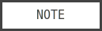
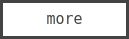
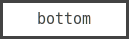

<p id="top" align="center">
  <a href="usage">
    
  </a>
  <a href="#examples">
    
  </a>
  <a href="#NOTE">
    
  </a>
  <a href="#more">
    
  </a>
  <a href="#bottom">
    
  </a>
  <a href="https://github.com/k-five/bline/blob/master/LICENSE">
    
  </a>
</p>

<br>
<br>


<br>

<p align="center">
welcome to <strong>beautiful line output</strong><br>
A simple CLI application for testing ANSI color written in `C`.
</p>

<br>

This is an application that you can use on your Console/Terminal.
It provides you some simple + friendly + flexible options which you
can use easily. There is no prerequisite except **compile** it with a `C` compiler.

<h3>core features:</h3>

 - support 3/4 bits : `ESC[Value;...;m`
 - support 24 bits  : `ESC[(38|48);2;...;m`
 - code generation (= dump code) see the second screenshot

<br>
<br>
<h1 id="usage" align="center">usage</h1>
<p align="center">
  &#9899; usage
  &#9898; <a href="#examples">examples</a>
  &#9898; <a href="#NOTE">NOTE</a>
  &#9898; <a href="#more">more</a>
  &#9898; <a href="#bottom">bottom</a>
  &#9898; <a href="#top">top</a>
</p>
<br>

 1. `git clone https://github.com/k-five/bline`
 2. `cd bline/src/`
 3. `make build`

<h3>usage (screenshot):</h3>
<br>
<br>

<br>

Then you have a binary file named: **bline** and you can put it in a valid path
that you have like: `/usr/bin/` or create your own path in `~/bin/` an put it
there. Or just use it in-place: `ls | ./bline -a red`

<br>
<h1 id="examples" align="center">examples</h1>
<p align="center">
  &#9898; <a href="#usage">usage</a>
  &#9899; examples
  &#9898; <a href="#NOTE">NOTE</a>
  &#9898; <a href="#more">more</a>
  &#9898; <a href="#bottom">bottom</a>
  &#9898; <a href="#top">top</a>
</p>
<br>

```
# all lines, foreground red:
ls | bline -a red

# all lines, foreground red, background green:
ls | bline -a red:green

# all lines, foreground is default (NOTE.3), background is green:
ls | bline -a :green

# add color-mode, odd lines (foreground) will be in light,italic,red
ls | bline -o light:red

# add text-mode, as well
ls | bline -o light:italic:cross:red

# combine options are okay:
ls | bline -a light:green -i red -I 7 -r yellow -R 5-10

# using hex value, foreground in red
df | bline -H -a ff00ff

# hex, foreground green, background red
df | bline -H -a 00ff00:ff0000

# hex just background
df | bline -H -a :ffff00

# look for string: 'sda' and make that/those line(s) green
lsblk | bline -m sda light:green
```
<br>
<br>
<h1 id="NOTE" align="center">NOTE</h1>
<p align="center">
  &#9898; <a href="#usage">usage</a>
  &#9898; <a href="#examples">examples</a>
  &#9899; NOTE
  &#9898; <a href="#more">more</a>
  &#9898; <a href="#bottom">bottom</a>
  &#9898; <a href="#top">top</a>
</p>
<br>

 1. The app creates code dynamically. If you are interested in see: `ansi_code.h`
 2. For non-HEX value it supports **color-mode** and **text-mode** and **foreground-color** and **background-color**.
 3. But for HEX value it supports only **foreground-color** and **background-color**.


<h3>goal</h3>
This app have been designed mostly for educational purpose then colorizing some lines.
Although it looks like that, but I added a lot of comments so you can read the source
code easily. The two main goals in this app are:
 1. how to use pointers and pointer arithmetic effectively
 2. how to use heap effectively
 3. how to use `bitwise` operators (see str2hex() function)

<h3>code generation example (screenshot)</h3>


<br>
For more screenshots see <a href="https://github.com/k-five/bline/tree/master/screenshot">screenshots</a> directory

<br>
<br>

<h1 id="more" align="center">more</h1>
<p align="center">
  &#9898; <a href="#usage">usage</a>
  &#9898; <a href="#examples">examples</a>
  &#9898; <a href="#NOTE">NOTE</a>
  &#9899; more
  &#9898; <a href="#bottom">bottom</a>
  &#9898; <a href="#top">top</a>
</p>
<br>

 - [Wikipedia](https://en.wikipedia.org/wiki/ANSI_escape_code)
 - [How to change the output color of echo in Linux](https://stackoverflow.com/questions/5947742/how-to-change-the-output-color-of-echo-in-linux/28938235#28938235)
 - [ANSI escape sequences](http://ascii-table.com/ansi-escape-sequences.php)

<br>
<br>

<h1 id="license" align="center">license</h1>
<p align="center">
  &#9898; <a href="#usage">usage</a>
  &#9898; <a href="#examples">examples</a>
  &#9898; <a href="#NOTE">NOTE</a>
  &#9898; <a href="#more">more</a>
  &#9899; bottom
  &#9898; <a href="#top">top</a>
</p>
<p id="bottom" align="center">
  bline copyright &copy; 2017 Shakiba
  <br>
  <br>
  ▒█▀▀█ ▒█▀▀█ ▒█░░░ █▀▀█<br>
  ▒█░▄▄ ▒█▄▄█ ▒█░░░ ░░▀▄<br>
  ▒█▄▄█ ▒█░░░ ▒█▄▄█ █▄▄█<br>
</p>
